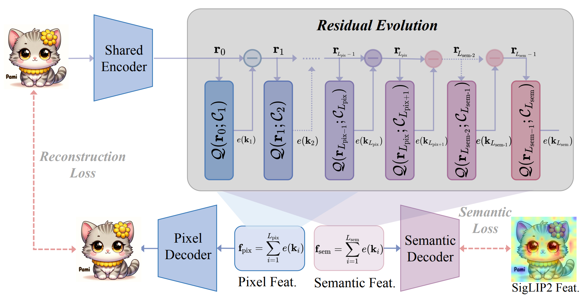
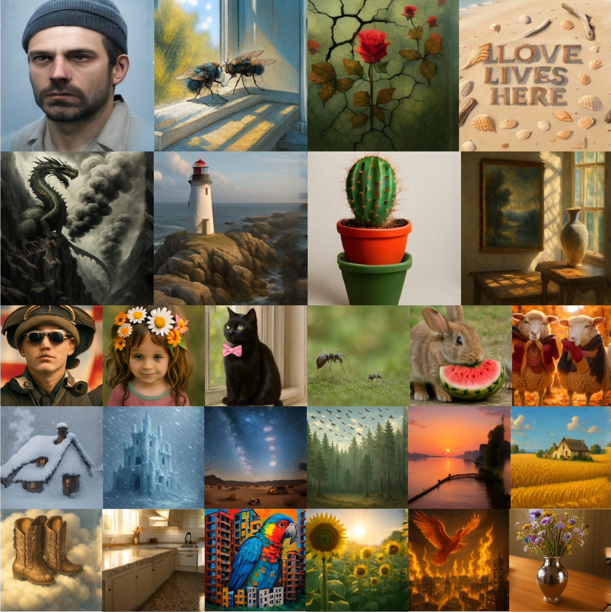

# EvoTok: A Unified Image Tokenizer via Residual Latent Evolution for Visual Understanding and Generation

[](https://arxiv.org/abs/2603.12108)


> 🎯 Code is currently being prepared and will be open-sourced in **March**, 2026.

## Highlights

🔗 **Unified & Consistent**: Reconciles the "granularity gap" by maintaining task-decoupled yet consistent representations within a shared space via residual evolution.

📊 **Data Efficient**: Trained entirely on fully open-source data (w/o any re-captioning or distillation). Despite using only 13M images, EvoTok achieves 0.43 rFID on ImageNet-1K (256×256).

🚀 **Versatile Performance**: Competitive results across 7/9 understanding benchmarks and leading generation benchmarks (e.g., GenEval, GenAI-Bench).

## Introduction

EvoTok is a unified image tokenizer designed to bridge the gap between high-level semantic and low-level pixel features. By modeling visual features as an evolutionary trajectory, EvoTok achieves strong performance in both domains within a single, shared latent space.




EvoTok delivers superior performance in multimodal understanding and text-to-image generation. For multimodal understanding, EvoTok achieves strong performance across a wide range of benchmarks. For text-to-image generation, it produces high-quality images at 256×256 resolution with strong visual fidelity and semantic alignment across diverse visual domains (portraits, landscapes, objects, etc.).




## Citation

```
@misc{li2026evotok,
      title={EvoTok: A Unified Image Tokenizer via Residual Latent Evolution for Visual Understanding and Generation}, 
      author={Yan Li and Ning Liao and Xiangyu Zhao and Shaofeng Zhang and Xiaoxing Wang and Yifan Yang and Junchi Yan and Xue Yang},
      year={2026},
      eprint={2603.12108},
      archivePrefix={arXiv},
      primaryClass={cs.CV},
      url={https://arxiv.org/abs/2603.12108}, 
}
```
